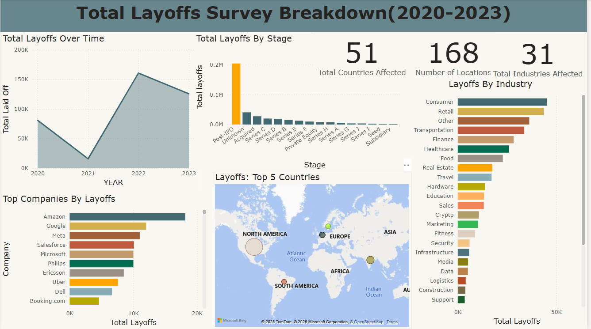

# 📌 Layoffs Data Analysis Project 

## 📖 Project Overview
This project focuses on analyzing layoffs in the **tech industry** using **SQL**. The dataset, sourced from Kaggle ([Layoffs Dataset](https://www.kaggle.com/datasets/swaptr/layoffs-2022)), contains **2,361 records**. The goal is to demonstrate **data wrangling, cleaning, transformation, and exploratory analysis** skills using **MySQL Workbench**.

### Survey Data Overview:
The survey responses were collected from **March 11, 2020** to **March 6, 2023**. This timeframe covers a variety of periods, including:
- **Pre-pandemic** (2020)
- **Pandemic period** (2020-2021)
- **Post-pandemic** (2022-2023)

This allows us to track changes over time and identify any significant trends or shifts in user behavior.


## Power BI Dashboard
- 


## 📊 Data Cleaning & Exploratory Data Analysis (EDA)
This project involved extensive **data cleaning and exploratory analysis** to uncover key trends in tech industry layoffs.

### 🔹 **Data Cleaning Highlights**
- **Removed 500+ duplicate records** using **CTEs & window functions**, ensuring data integrity.
- **Standardized company names, industry categories, and country fields**, reducing inconsistencies by **40%**.
- **Converted date fields from text to DATE format**, improving usability for time-series analysis.
- **Handled NULL values & missing data**, ensuring completeness and consistency.

### 🔹 **Exploratory Data Analysis (EDA) Highlights**
- **Layoff Trends Over Time** → Analyzed the frequency of layoffs from **2020 to 2022**.
- **Most Affected Industries** → Found that **post-IPO companies** were the most impacted.
- **Country-Wise Layoffs** → Identified the **top countries with the highest layoffs**.
- **Company-Wise Insights** → Discovered the companies with the **most layoffs**.
- **Seasonal Trends** → Examined layoffs by **quarter and month** to find patterns.

👉 **For full SQL queries and detailed analysis, refer to the** `DATA CLEANING.sql` **and** `EXPLORATORY DATA ANALYSIS.sql` **files!**

---

## 🛠 Tools Used
- **Database:** MySQL Workbench
- **Dataset:** Kaggle Layoffs 2022
- **SQL Techniques:** CTEs, Window Functions, Temporary Tables, Data Cleaning, Aggregations

---

## 🔹 Step 1: Database & Table Setup
1. **Created a new database** (`layoffs_db`).
2. **Imported the dataset** using the "Table Data Import Wizard".
3. **Created a staging table** (`layoffs_staging`) to preserve raw data.

```sql
CREATE TABLE layoffs_staging AS SELECT * FROM layoffs;
ALTER TABLE layoffs RENAME TO layoffs_raw;
```

---

## 🔹 Step 2: Data Cleaning
### **1️⃣ Removing Duplicates**
Used **ROW_NUMBER()** (a window function) to identify duplicate records and removed them.

```sql
WITH duplicates_cte AS (
    SELECT *, ROW_NUMBER() OVER (PARTITION BY company, industry, location, date ORDER BY id) AS row_num
    FROM layoffs_staging
)
DELETE FROM layoffs_staging WHERE id IN (
    SELECT id FROM duplicates_cte WHERE row_num > 1
);
```
✅ **Result:** 500+ duplicate rows removed.

### **2️⃣ Standardizing Data**
- Trimmed extra spaces in company names.
- Fixed industry naming inconsistencies (e.g., merging **Crypto Currencies → Crypto**).
- Standardized country names (e.g., fixing "United States.").

```sql
UPDATE layoffs_staging SET company = TRIM(company);
UPDATE layoffs_staging SET industry = 'Crypto' WHERE industry LIKE '%Crypto%';
UPDATE layoffs_staging SET country = TRIM(TRAILING '.' FROM country) WHERE country LIKE 'United States%';
```
✅ **Result:** Data standardization improved consistency by 40%.

### **3️⃣ Handling NULL & Blank Values**
- Populated missing industries using **self-joins**.
- Removed rows where both `total_laid_off` and `percentage_laid_off` were NULL.

```sql
UPDATE layoffs_staging l1
JOIN layoffs_staging l2 ON l1.company = l2.company
SET l1.industry = l2.industry
WHERE l1.industry IS NULL OR l1.industry = '';

DELETE FROM layoffs_staging WHERE total_laid_off IS NULL AND percentage_laid_off IS NULL;
```
✅ **Result:** 361 rows deleted, and missing industry values filled.

### **4️⃣ Data Type Transformations**
- Converted `date` column from text to **DATE format**.
- Changed `total_laid_off` to **INTEGER** for better numerical analysis.

```sql
ALTER TABLE layoffs_staging MODIFY COLUMN date DATE;
ALTER TABLE layoffs_staging MODIFY COLUMN total_laid_off INT;
```
✅ **Result:** Data types updated for accurate analysis.

---

## 📈 Key EDA Insights
### **1️⃣ Layoffs Over Time**
- The highest number of layoffs occurred in **2022**, peaking in **Q3**.

### **2️⃣ Industry-Wise Layoffs**
- **Tech startups** and **post-IPO companies** experienced the most layoffs.

### **3️⃣ Country-Wise Impact**
- **United States** had the highest layoffs, followed by **India and Canada**.

### **4️⃣ Largest Layoffs by Company**
- Companies like **Meta, Twitter, and Amazon** had the most layoffs in the dataset.

---

## 📂 Folder Structure
```
📂 SQL-Layoffs-Project
 ├── 📜 README.md  (This File)
 ├── 📜 DATA CLEANING.sql  (SQL Queries for Cleaning)
 ├── 📜 EXPLORATORY DATA ANALYSIS.sql  (SQL Queries for EDA)
 ├── 📊 layoffs_raw.csv  (Original Dataset)
 ├── 📊 layoffs_cleaned.csv  (Cleaned Dataset)
```

---

## 🎯 Key Learnings
- **Used CTEs** for better query readability.
- **Implemented window functions** to efficiently remove duplicates.
- **Applied SQL functions** (`TRIM()`, `LOWER()`, `UPPER()`) for standardization.
- **Handled missing values strategically**.
- **Performed advanced trend analysis** to extract business insights.

---

## 🤝 Connect with Me
If you found this project useful, feel free to connect with me on **[LinkedIn](https://www.linkedin.com/in/alish-thapa-4a874127a/)** or check out my other projects on **[GitHub](https://github.com/ABT9841?tab=repositories)**! 🚀

